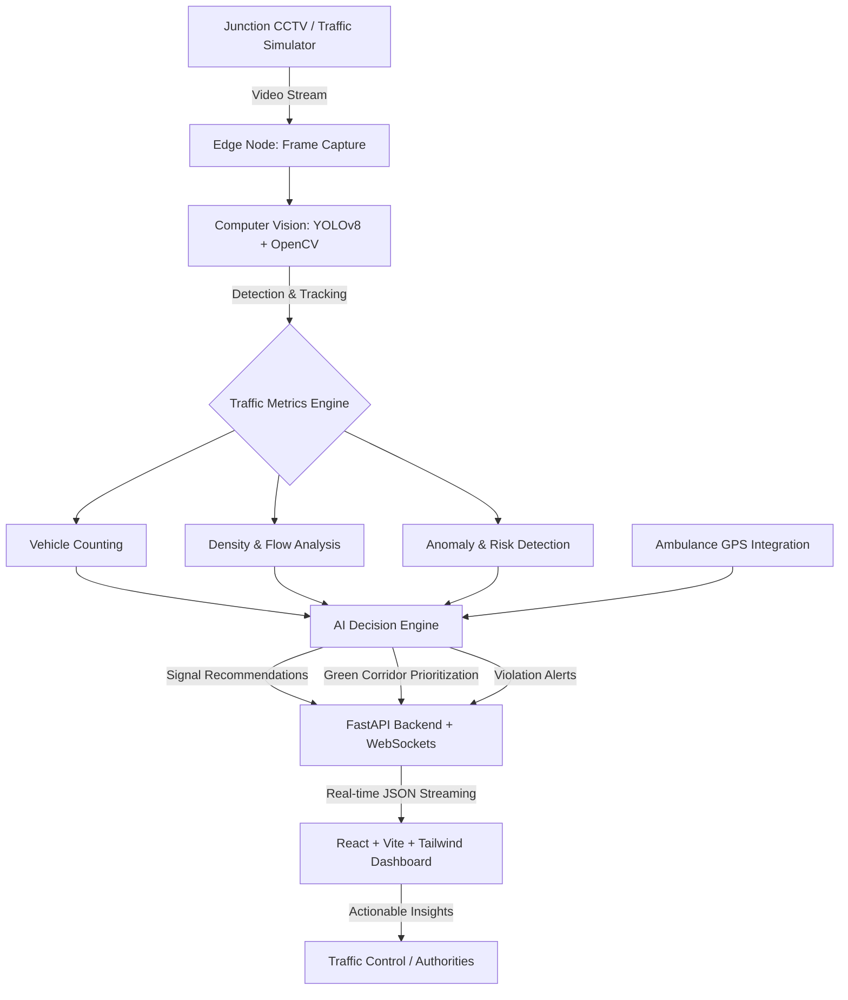

# 🚦 SARATHI - AI-Driven, Vision-Zero Traffic Intelligence
**Unified Adaptive Signal Intelligence, Patient-Triage Emergency Corridors & Vision-Zero Crash Interception Engine**

*Developed for the Smart City / Urban Mobility theme of the Vikasit Nagpur Hackathon 2026*

---

## 📌 Executive Summary
**SARATHI** is a state-of-the-art, AI-driven Intelligent Traffic Management System (ITMS) specifically engineered for Indian cities characterized by heterogeneous and mixed traffic conditions. Moving beyond legacy fixed-time controllers and manual CCTV monitoring, SARATHI leverages cutting-edge **Computer Vision (YOLOv8 + OpenCV)** and **Real-Time Edge Analytics** to transform raw traffic video feeds into actionable decision intelligence.

Our solution establishes a real-time, closed-loop system encompassing **Adaptive Signal Control**, **Emergency Vehicle Prioritization (Green Corridors)**, and **Predictive Safety Analytics**.

## 🏗️ High-Level Architecture
SARATHI follows an edge-to-cloud distributed architecture ensuring low latency and high scalability across urban junctions.

## 🧠 Core Technical Modules

### 1. Advanced Computer Vision Pipeline (Perception Layer)
- **Object Detection Model:** Fine-tuned **YOLOv8** optimized for heterogeneous traffic (cars, buses, motorcycles, auto-rickshaws, emergency vehicles).
- **Video Processing:** Hardware-accelerated frame extraction and preprocessing utilizing **OpenCV**.
- **Edge Inference:** Processing occurs at the edge to reduce bandwidth overhead. Only lightweight JSON metadata is transmitted to the central server.

### 2. Traffic Analytics & Congestion Detection (Situation Understanding Layer)
- **Real-Time Vehicle Counting:** Aggregates multi-class vehicle counts per lane/junction.
- **Density Estimation:** Calculates spatial density ($Density = \frac{N_{vehicles}}{Effective\ Road\ Area}$) dynamically to assess congestion severity.
- **Adaptive Thresholding:** Employs dynamic thresholds to classify traffic states (Normal, Moderate, Severe) mitigating false positives from stationary overlapping vehicles.

### 3. Emergency Green Corridor Generation (Decision Intelligence Layer)
- **GPS Telemetry Simulation:** Ingests live telemetry from approaching ambulances.
- **Predictive ETA Calculation:** Estimates arrival times at subsequent junctions ($ETA = \frac{Distance}{Estimated\ Speed}$).
- **Preemptive Signal Override:** Autonomously calculates optimal routing and suggests "Green Wave" synchronization across consecutive nodes to ensure zero-wait transit for emergency vehicles.

### 4. Smart Anomaly & Risk Detection (Vision-Zero Engine)
Identifies erratic driving patterns that act as precursors to accidents:
- **Overspeeding Detection:** Velocity estimation across sequential frames.
- **Trajectory Violations:** Detects illegal lane-cutting and wrong-direction driving.
- **Erratic Driving Patterns:** Identifies suspected D&D (Drink & Drive) or rash driving via non-linear movement heuristics.

## 💻 Technology Stack

### Artificial Intelligence & Computer Vision
- **Model:** YOLOv8 (Ultralytics) for high-speed, high-mAP object detection.
- **Vision Library:** OpenCV for tensor preprocessing, bounding box mapping, and video I/O.
- **Language:** Python 3.10+

### Backend & Middleware
- **Framework:** FastAPI for high-performance, asynchronous REST APIs.
- **Real-Time Protocol:** WebSockets for bidirectional, low-latency telemetry streaming (crucial for live dashboard updates).
- **Data Exchange:** Highly optimized, strictly typed JSON payloads.

### Frontend Control Center
- **Framework:** React.js powered by Vite for rapid HMR and optimized build times.
- **Styling:** Tailwind CSS for responsive, accessible, and highly customizable UI components.
- **Visualization:** Real-time metrics dashboard, alert consoles, and junction heatmaps.

## 🚀 Data Flow Lifecycle
1. **Acquisition:** Raw frames ingested from CCTV/Simulator.
2. **Inference:** YOLOv8 detects multi-class objects.
3. **Extraction:** Coordinates and classes mapped to density/flow metrics.
4. **Analysis:** Heuristics engines evaluate congestion status and intercept anomalies.
5. **Orchestration:** Backend evaluates Ambulance GPS against current junction load.
6. **Delivery:** WebSockets push sub-second JSON updates to the React Command Center.
7. **Action:** Traffic authorities review Signal Suggestions and Actionable Alerts.

## 🛠️ Overcoming Engineering Challenges
- **Occlusion & Density:** Implemented robust bounding-box overlap handling for dense Indian traffic scenarios.
- **Computational Overhead:** Shifted frame analysis to the edge; ensuring the backend only processes JSON metadata, making the system linearly scalable.
- **Night-Vision Degradation:** Leveraging YOLOv8's robust feature extraction capabilities on low-illumination and noisy data streams.

## 🌍 Strategic Impact & Alignment
SARATHI aligns seamlessly with global and national sustainability goals:
- **SDG 3:** Good Health and Well-Being (Accelerated emergency response).
- **SDG 9:** Industry, Innovation and Infrastructure (Modernizing urban mobility).
- **SDG 11:** Sustainable Cities and Communities (Data-driven traffic optimization).
- **SDG 13:** Climate Action (Reduced idling emissions).

## 🔮 Future Roadmap: Multi-Agent Neural Traffic Network
The next iteration of SARATHI transitions from isolated junction intelligence to a **Distributed Multi-Agent System (MAS)**:
- **Inter-Junction Telemetry:** Edge nodes autonomously sharing traffic load states with adjacent nodes.
- **Global Signal Optimization:** Reinforcement Learning models optimizing city-wide flow, drastically reducing gridlocks.
- **Hardware Integration:** Direct REST/MQTT bridging with physical VMS (Variable Message Signs) and Traffic Signal Actuators.

---

<i>"Transforming Vision into Intelligence, Intelligence into Action."</i>

